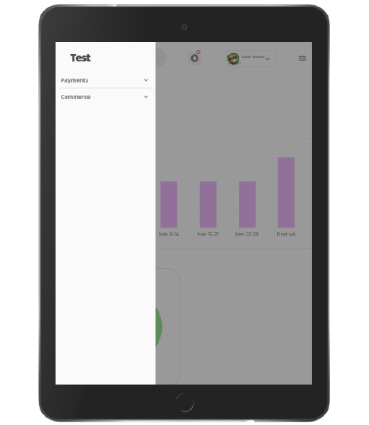

# <p align="center"> :bar_chart: DASHBOARD QUASAR VUE.JS <p>


# DESCRIPTION

A **Single Page Web-based Application** Developed Using **Quasar VueJs Framework** used to Display and Hold Application Data.


# DISPLAY

## Display Video

<p align="center">

<p>


## Landing Page Page

<p align="center">

<p>

## Landing Page Page Scroll

<p align="center">

<p>

## Mobile View

<p align="center">


<p>

## Tablet View

<p align="center">



<p>

# SETUP/INSTALLATION REQUIREMENTS.

**Follow The Below nstructions For Set Up.**


**1. [Install Quasar](https://quasar.dev/start/vue-cli-plugin)**

To make sure you have the **right version,** use this command:

###### `Terminal`

```
vue --version
```

**Install Vue CLI** (v4+) as follows:

###### `Terminal`

```
npm install -g @vue/cli
```


**2. [Clone The Repository](https://docs.github.com/en/github/creating-cloning-and-archiving-repositories/cloning-a-repository)**

Open Terminal and **Change the current working directory to the location** where you want the cloned directory.

Type **git clone,** and then paste the URL

###### `Terminal`

```
git clone https://github.com/USERNAME/REPOSITORY
```

**3. [Open the CLoned Repository to Install Dependancies before Running the Project.](https://quasar.dev/quasar-cli/commands-list)**

**4. [Install Fusion Charts Components Via npm](https://www.fusioncharts.com/dev/getting-started/vue/your-first-chart-using-vuejs)**

FusionCharts is a **JavaScript charting library that enables you to create interactive charts** in the Project For Deeper clarification check Out Fusion Charts From the link below :point_down:

**[Fusion Chart](http://www.reddit.com)**

**Install Fusion Charts**

###### `Terminal`

```
npm install fusioncharts vue-fusioncharts --save
```

**5. [Start Development Server](https://quasar.dev/quasar-cli/commands-list)**

You can start the **development server by using “quasar dev”** command

###### `Terminal`

```
quasar dev
```


**6. [Incase of Errors When Starting the Server](https://quasar.dev/introduction-to-quasar)**

- Everything should worked after the process but **incase of error when raning the server Deleted ```node_modules``` folder and ran ```npm install```** After that, quasar dev should ran ok. **Incase of another error reffer from the Quasar Documentation**

###### `Terminal`

```
npm install
```


#  PREREQUISITES

- You need to have nano text editor installed. you can find out whether you have it installed by **typing nano --version in your terminal.** For most linux distributions, it is installed by default. However, if you don't have it installed, **you can quicky do that by typing sudo apt-get install nano in your terminal.**

- You need to have the following installed in your machine

**1.  Node.js.**

**2. Quasar FrameWork.**

**3. Npm Package Manager.**


# TECHNOLOGIES USED

**1. HTML**

**2. SSS**

**3. JavaScript**

**4. Fusion Chart Charting Library**

**5. Quasar FrameWork**

**6. Vue.js**

**6. Adobe Photoshop**

# FAQ

**Check Out Some More Of My Projects Check Out My Repository** and You Could Tell Me What You Think.

[:blush: My Repository](https://github.com/zecollokaris?tab=repositories)

**I would Recommend** 

**1. [CryptoByte](https://github.com/zecollokaris/CryptoByte-Blockchain-Android)**

**2. [Remote Control Quadcopter](https://github.com/zecollokaris/Remote-Control-Falcon-1-Quadcopter)**

:stuck_out_tongue: 
